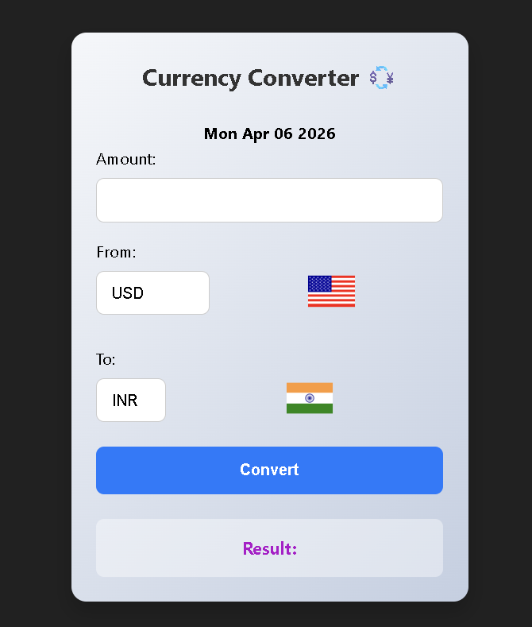

# 💱 Currency Converter

A simple and responsive **Currency Converter Web App** built using **HTML, CSS, and JavaScript**.
It allows users to convert currency values in real-time using exchange rates and displays country flags for selected currencies.

---

## 🚀 Features

* Convert currency from one country to another
* Real-time exchange rate calculation
* Dynamic country flag display
* Clean and responsive UI
* Shows current date of exchange rate

---

## 🛠️ Technologies Used

* HTML5
* CSS3
* JavaScript (Vanilla JS)
* Exchange Rate API
* Flags API

---

## 📂 Project Structure

```
currency-converter/
│── index.html
│── style.css
│── script.js
│── README.md
```

---

## ▶️ How to Run the Project

1. Download or clone the repository
2. Open the project folder
3. Double-click `index.html`

OR

Run using Live Server in VS Code.

---

## 🌐 Live Demo

🚀 **Try the app here:**
https://currency-converter-ntc.netlify.app/


---

## 📸 Screenshot



---

## 👨‍💻 Author

**Mayank**
CSE (AI-ML) Student

---

## 📌 Future Improvements

* Add more currencies
* Add dark mode
* Improve mobile responsiveness
* Add historical exchange rate chart
